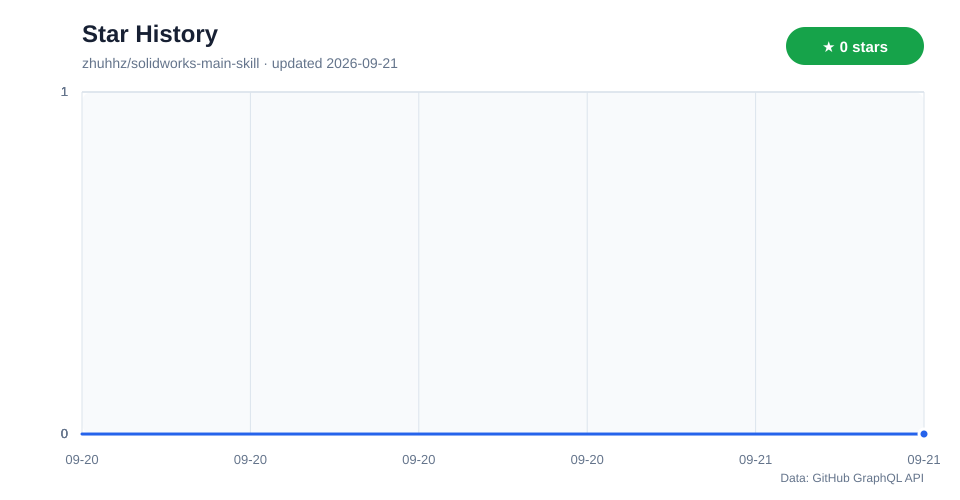

# SolidWorks Automation Skill

[](https://opensource.org/licenses/MIT)
[](https://www.python.org/downloads/)
[](https://www.solidworks.com/)

CAD Studio 桌面端与 Skill/CLI/MCP 是平级入口：这个仓库同时可以作为 Skill 包和 MCP Server 使用。Skill 适合导入支持 skills 的客户端，MCP 适合做本地工具连接；两者共用同一套能力和脚本。实际可执行范围以根目录 `capabilities.yaml` 为唯一真源；未验证能力不会被包装成已完成的无人值守交付。

> 可靠性边界：当前真机基线为 SolidWorks 2024、SolidWorks 2026 SP01.1 和 AutoCAD 2024。SolidWorks 2026 仅对能力清单中列出 2026 的能力视为已验证；SolidWorks 2025 及其余未回归能力仍是兼容性目标。配置族、钣金 U 型轮廓法兰/展开 DXF，以及 HSS 矩形焊接框架/切割清单已进入 `pilot`；设计表与复杂钣金/焊件仍是兼容目标。C# Add-in 宿主已完成强名称构建、COM 冒烟和严格注册门禁，但当前非管理员会话未完成 HKLM 注册后的进程内 UI/事件回归，因此不列入已验证版本。Simulation/FEA、Routing、复杂曲面和模具也处于受控 `pilot` 门禁，不能冒充原生完整交付。

## 下载与首次启动

三种入口互相独立，按使用习惯任选其一：

| 入口 | 适合用户 | 下载/安装 |
|---|---|---|
| Skill | 已在使用支持 skill 导入的客户端 | `npx github:wzyn20051216/solidworks-automation-skill`，或 `claude skill add https://github.com/wzyn20051216/solidworks-automation-skill` |
| MCP | 已在使用 Codex、Claude Code、Cursor、Windsurf 或其他 MCP 客户端 | 推荐通过 [Smithery](https://smithery.ai/servers/wzyn20051216/solidworks-automation-skill) 安装：`smithery mcp add wzyn20051216/solidworks-automation-skill --client codex --config '{}'` |
| CAD Studio 桌面版 | 希望用图形界面管理项目、对话、任务、预览和交付 | 从 [GitHub Releases](https://github.com/wzyn20051216/solidworks-automation-skill/releases) 下载 Windows 安装包或便携 ZIP |

如果本机还没有 Smithery CLI，先安装一次：

```powershell
npm install -g @smithery/cli
```

已能运行 `smithery --version` 的用户可跳过这一步。其他客户端可把命令中的 `--client codex` 替换为 `--client claude`、`--client cursor`、`--client windsurf` 等 Smithery 支持的目标。

Smithery 安装后，可在 MCP 客户端调用 `solidworks_health_check` 检查本机环境。使用 `npx` 或手动克隆的用户，也可以进入 Skill 目录执行诊断：

```powershell
python scripts/cad_doctor.py
python scripts/cad_studio.py doctor
```

诊断结果中的 `remediations` 会列出缺失项、影响范围、官方地址和可复制的安装命令。缺少 SolidWorks/AutoCAD 时只阻断对应原生格式，STEP/IGES/BREP/STL/OBJ/GLB/DXF/SVG/PDF/PNG 等开放格式仍可继续。桌面端会在“设置”和“帮助”中显示相同建议。

需要提交问题时，再生成脱敏诊断包：

```powershell
python scripts/cad_studio.py export-diagnostics --output .\cad-studio-diagnostics.zip
```

诊断包只包含版本、阶段、错误码和耗时等脱敏信息，不包含 Prompt、模型内容、API Key 或完整私人路径。

队列任务也可脱离桌面端操作：

```powershell
python scripts/cad_studio.py status
python scripts/cad_studio.py run --enable-mock
python scripts/cad_studio.py retry <job-id>
python scripts/cad_studio.py cancel <job-id>
python scripts/cad_studio.py write-open-format --input .\part.cadstudio.json --out-dir .\output
python scripts/cad_studio.py preview-dxf --input .\drawing.dxf --output .\output\drawing.scene.json
python scripts/cad_studio.py check-dfm --input .\part.cadstudio.json --output .\output\dfm.json --profile .\supplier-profile.json
python scripts/cad_studio.py check-routing --input .\route.json --output .\output\routing_report.json
python scripts/cad_studio.py fea-preflight --solver auto
python scripts/cad_studio.py prepare-fea --input .\fea.json --out-dir .\output\fea
python scripts/cad_studio.py run-fea --input .\fea.json --out-dir .\output\fea --timeout 120
python scripts/cad_studio.py run-fea-convergence --input .\fea-convergence.json --out-dir .\output\fea-convergence --timeout-per-case 120
python scripts/cad_studio.py review-advanced-geometry --input .\surface-plan.json --output .\output\surface_report.json
python scripts/cad_studio.py create-ocp-loft --input .\loft.json --out-dir .\output\loft
python scripts/cad_studio.py create-ocp-surface --input .\smooth-loft.json --out-dir .\output\surface
```

<p align="center">
  
  <br>
  <strong>关注抖音 @balance.</strong>
  <br>
  <sub>嵌入式开发、SolidWorks 自动化和 AI 辅助工程实践持续更新</sub>
</p>

[English](#english) | [中文](#中文)

> **CAD Studio 桌面版**：下载、环境要求和完整操作流程见 [CAD Studio 用户说明书](docs/CAD_STUDIO_USER_MANUAL.md)。Windows 安装包与便携 ZIP 发布在 [GitHub Releases](https://github.com/wzyn20051216/solidworks-automation-skill/releases)。

---

## 中文

### 🎞️ 真机案例：复杂测试件工程图

<p align="center">
  
</p>

这个案例不是概念动画：`solidworks-engineering-drawing` 在 SolidWorks 2026 SP01.1 中读取 NIST 公共领域复杂测试件，核对 `141.421 × 141.421 × 17 mm` 包围盒，并生成原生 `SLDPRT + SLDDRW + PDF + evidence/review JSON`。工程图包含三视图、等轴测图、A-A 剖视和 10 个必需尺寸；当前工程图定向测试为 70 项通过，实验产物的 PDF 可提取文字边界为 0 重叠。

> 工程图能力当前仍为 `pilot`。自动检查可以发现缺失输出和明显碰撞，但图框、尺寸链、孔表及制造语义仍要求工程师做最终目视复核。测试件来源为 NIST 公共领域资料，并非仓库自创的官方基准模型。

#### 更多已验证案例

| 案例 | 对应能力 | 已有证据 | 当前等级 |
|---|---|---|---|
| [NIST 复杂测试件工程图](subskills/solidworks-engineering-drawing/README.md) | GB/T 第一角工程图、尺寸链、PDF 边界审查 | SolidWorks 2026 原生零件/工程图/PDF、5 个视图、10 个必需尺寸、A-A 剖视 | `pilot`，人工复核必需 |
| [M6×1 真实螺纹孔](subskills/solidworks-threaded-holes/README.md) | 盲孔/贯穿孔、Metric Tap Thread、孔口倒角 | 重建后回读真实 Thread；SLDPRT/STEP/四视图；review `pass/100` | `verified` |
| [CNC 多圆角/倒角安装座](subskills/solidworks-fillet-chamfer-cnc/README.md) | 参数/碰撞预检、语义选边、三控制点可变半径、face/full-round/setback、G2 曲面组合、宽度-宽度倒角、沉孔、长圆槽、CNC 友好口袋 | SW2026 SP1.1：六项高级路径完成 SLDPRT/STEP/重开/FeatureData 读回；开源角支架在固定斜边完成 C0.2/C0.4 倒角并保持处理后拓扑；保持线仍明确 blocked | `stable` 子技能 |
| [桌面迷你风扇运动装配](examples/08_mini_fan_motion_assembly.py) | 多零件建模、装配 Mate、旋转马达 Motion Study | 4 个零件、原生装配体、Mate/Motion 验证脚本 | `pilot`，人工复核必需 |

### ✨ 特性

- 🔧 **零件建模** - 草图绘制、拉伸、旋转、倒角、圆角、阵列等
- 🧭 **多语言后端路由** - 按原子操作在 Python、C# PIA/Add-in、原生 C++、SWBasic、OCCT 和外部求解器之间选择，区分 Automation 等价语义与精确原生接口
- 🧩 **C# Add-in 宿主（试点）** - `net48/x64` 强名称程序集覆盖应用事件、三命令 CommandGroup、TaskPane、完整 PMP Handler 与 JSON 诊断；Machine 注册和真机 Probe 见 [`references/solidworks-addin-host.md`](references/solidworks-addin-host.md)
- 🧱 **无 CAD 开放格式后端** - OCCT/OCP 隔离进程真实写入 STEP、IGES、BREP、STL、OBJ、GLB，二维后端写入 DXF、SVG、PDF、PNG；复杂特征按能力门禁阻断
- 🧠 **VibeCAD 参数化规划** - 将自然语言需求转换为设计计划、制造规则检查、SolidWorks API 执行摘要和审查门禁
- 🧵 **螺纹孔建模** - 攻丝底孔、M3/M4/M5/M6/M8 盲孔/通孔、孔口倒角、装饰螺纹与可见螺旋线兜底
- 🧾 **AutoCAD / DWG 子技能** - DXF 无头预览与结构审查可用；AutoCAD 原生 DWG 绘图仍受本机 ActiveX 代理稳定性门禁，详见能力清单
- 🔄 **签名自动更新** - Windows 桌面版启动后静默检查 GitHub Release，发现新版本后由用户确认下载和安装；失败时保留手动下载入口
- 🔩 **装配体操作** - 添加组件、配合关系、干涉检查、爆炸视图
- 📐 **工程图出图** - 三视图、剖视图、尺寸标注、BOM 表
- 🧾 **工程图专业子技能** - `solidworks-engineering-drawing` 独立负责 GB/T 第一角工程图、尺寸链、孔表、BOM、PDF/BMP 证据和制造交付审视，可由根技能或任意相关子技能按需连接
- 💾 **文件导出** - STEP、STL、IGES、PDF、DXF/DWG、Parasolid；SW2026 SP01.1 基础装配已通过原生 Pack and Go 连续回归，复杂引用缺失时仍按门禁生成带哈希清单的 `pilot` 暂存包
- 🧩 **网格参考导入** - 将公开 GLB/OBJ/STL 外观参考模型缩放、转换并导入为 SolidWorks 参考零件
- 🎨 **外观材质** - 文档、特征、组件级颜色设置，支持装配体分色建模
- 🎬 **Motion Study** - 自动创建运动算例、匀速旋转马达并计算/播放动画
- 🔌 **MCP Server** - 将 SolidWorks COM 自动化封装成 Codex / Claude / Cursor 可调用的本地 MCP 工具，覆盖基础建模、装配、Mate、外观、导出、审查和旋转马达
- 🔨 **钣金设计（试点）** - SW2026 已验证开放 U 型轮廓双折弯、板厚/半径/K 因子重开回读及含折弯线 DXF；复杂钣金仍需人工复核
- ⚡ **焊件设计（试点）** - SW2026 已验证自定义 `.sldlfp`、四根 HSS 斜接框架、按长度/数量分组的原生切割清单及 CSV；回归数据来自 MIT 许可的 [Coremark Weldment Profiles](https://github.com/someoneskater/Coremark-Weldment-Profiles)
- 📊 **FEA 仿真（试点）** - CalculiX 2.23 已真实求解线性静力、NLGEOM、受限塑性和双实体面接触样件，可解析最终步穿透/压力/滑移并执行线性或非线性网格收敛序列；结果统一保留人工复核，不等于安全认证
- 📝 **配置与属性** - SW2026 已真机验证三配置创建/切换、配置尺寸/属性和保存重开；设计表仍按能力清单限制使用
- 🏭 **DFM 制造复核（试点）** - 机加工、钣金、激光切割和 3D 打印的结构化风险检查，支持供应商 profile 与 B-Rep 证据绑定；规则通过仍需人工确认
- 🧭 **Routing 中性复核（试点）** - 校验端点、分段、长度、弯曲半径、碰撞/间隙、支撑间距和 Routing BOM；未发现 Routing 加载项/许可证时原生写入保持 `blocked`
- 🧰 **复杂曲面/模具（试点）** - OCP 可真实生成并重开受限直纹/平滑 Loft、直线/圆弧 Sweep、闭壳 Knit 和开放面 Thicken；G1/G2 与局部曲率半径只代表离散采样证据，不替代全局无自交、Class-A 或模具设计
- 👀 **结果自审查** - 导出多视角预览图、`review_report.json` 与 Markdown 摘要，帮助代理复核模型是否符合意图
- 🔎 **API 查证优先** - 未封装接口先查官方 API Help / 本地 SDK，再实现、运行、自审查并沉淀

### 📋 环境要求

- **操作系统**: Windows 10/11
- **SolidWorks/AutoCAD**: 原生格式操作需要合法安装；当前真机版本为 SolidWorks 2024/2026 和 AutoCAD 2024，具体能力以 `capabilities.yaml` 的版本字段为准
- **Python**: 3.10 或更高版本
- **Windows 原生 CAD 依赖库**: `pywin32`、`comtypes`
- **无头写入**: 不要求安装 SolidWorks/AutoCAD；DXF 需要 `ezdxf`
- **OCCT 几何后端**: 安装 `requirements-occt.txt` 后启用 STEP/IGES/BREP/GLB 和布尔孔切除
- **开放 FEA**: CalculiX 可作为外部 GPL 求解器放在 D/E 盘；程序不会把其二进制打包进 MIT 发布物
- **工程图最终审查依赖**: `PyMuPDF`，用于读取 SolidWorks 导出 PDF 的实际尺寸文字边界；已包含在 `requirements.txt`
- **网格转换可选依赖**: `trimesh`、`pygltflib`、`numpy`、`Pillow`

> 运行前可执行 `python scripts/sw_preflight.py`。如果缺少 `comtypes` / `win32com`，脚本会先询问是否授权 AI 自动配置本地环境；如果未检测到 SolidWorks，会直接停止并提示先手动安装 SolidWorks。

#### 缺少环境时去哪下载

| 环境 | 什么时候需要 | 官方地址或安装命令 |
|---|---|---|
| Python 3.10+ | 所有本地 Skill/CLI 工作流 | [Python for Windows](https://www.python.org/downloads/windows/) 或 `winget install -e --id Python.Python.3.12` |
| pywin32 / comtypes | SolidWorks、AutoCAD COM 原生自动化 | `python -m pip install "pywin32>=305" "comtypes>=1.2.0"` |
| ezdxf | DXF 无头读写、图层和实体检查 | `python -m pip install "ezdxf>=1.3,<2"` |
| OCP / OCCT | STEP、IGES、BREP、GLB 无头几何写入 | `python -m pip install -r requirements-occt.txt` |
| PyMuPDF | 工程图最终 PDF 尺寸文字边界审查，工程图交付必需 | 已随 `python -m pip install -r requirements.txt` 安装 |
| CalculiX | 开放 FEA 求解 | [CalculiX 官方站](https://www.calculix.de/)；解压到 D/E 盘后设置 `CADSTUDIO_CALCULIX_EXE` 指向 `ccx.exe` |
| Agent CLI | AI 对话与任务执行，安装任意一个即可 | [Codex](https://developers.openai.com/codex/cli/) / [Claude Code](https://docs.anthropic.com/en/docs/claude-code/overview) / [Gemini CLI](https://github.com/google-gemini/gemini-cli) / [OpenCode](https://opencode.ai/) |
| SolidWorks | `SLDPRT/SLDASM/SLDDRW` 原生格式 | [SolidWorks 官方站](https://www.solidworks.com/)；需要合法安装与可用许可 |
| AutoCAD | 原生 DWG 后端 | [AutoCAD 官方站](https://www.autodesk.com/products/autocad/overview)；需要合法安装与可用许可 |

安装依赖后重新运行 `python scripts/cad_studio.py doctor`。不要为了补齐可选环境一次性安装全部依赖；工程图交付除外，它要求 `requirements.txt` 中的 PyMuPDF。

### 🚀 快速开始

#### 方式一：Skill 安装（推荐给支持 skill 的客户端）

```bash
npx github:wzyn20051216/solidworks-automation-skill
```

如果客户端支持直接导入 skill，也可以使用：

```bash
claude skill add https://github.com/wzyn20051216/solidworks-automation-skill
```

#### 方式二：Smithery 安装 MCP

```powershell
npm install -g @smithery/cli
smithery mcp add wzyn20051216/solidworks-automation-skill --client codex --config '{}'
```

如果已经安装 Smithery CLI，第一行可以跳过。`wzyn20051216/solidworks-automation-skill` 是 Smithery 上的本地 `stdio` MCP 包；不要用 `server.smithery.ai/...` URL 安装这个包。

Codex 以外的客户端可把 `--client codex` 改为 Smithery 支持的目标，例如 `claude`、`cursor`、`vscode`、`windsurf` 或 `opencode`。

安装后如果客户端已经打开，建议重启对应客户端；部分客户端首次加载本地 MCP 时可能还需要在界面中确认信任。

#### 方式三：OpenClaw / 龙虾 使用

OpenClaw 兼容本 skill 的 `SKILL.md + scripts/ + references/` 目录结构。推荐把技能放在以下任一目录：

```text
~/.openclaw/skills/solidworks-automation/
~/.agents/skills/solidworks-automation/
```

安装后，可直接在 OpenClaw 中使用自然语言驱动 SolidWorks，例如：

```text
用 SolidWorks 新建一个 120x80x10 mm 的安装板，四角各打一个 phi6 孔，保存到 C:\temp\plate.sldprt，并导出 STEP 到 C:\temp\plate.step
```

OpenClaw 侧的接入约定、执行模板与排障说明见：

```text
references/openclaw.md
```

#### 方式四：手动克隆

##### 1. 克隆仓库

```bash
git clone https://github.com/wzyn20051216/solidworks-automation-skill.git
cd solidworks-automation-skill
```

##### 2. 安装当前任务需要的依赖

```bash
python -m pip install -r requirements.txt
```

如果需要处理 GLB/GLTF/OBJ/STL 等公开网格参考模型，并进行包围盒检查、尺度缩放或格式转换，额外安装：

```bash
python -m pip install -r requirements-mesh.txt
```

##### 3. 诊断环境

```bash
python scripts/cad_studio.py doctor
```

##### 4. 运行示例

确保 SolidWorks 已经运行,然后执行:

```python
import sys
sys.path.insert(0, r"./scripts")

from sw_preflight import run_preflight
from sw_connect import connect_solidworks, mm, deg, new_document
from sw_part import start_sketch, sketch_rectangle, end_sketch, extrude_boss

run_preflight()

# 连接 SolidWorks
sw, model = connect_solidworks()

# 创建新零件
model = new_document(sw, "part")

# 在前视基准面上绘制矩形
start_sketch(model, "Front Plane")
sketch_rectangle(model, 0, 0, mm(50), mm(30))
end_sketch(model)

# 拉伸 10mm
extrude_boss(model, "Sketch1", mm(10))

print("零件创建完成!")
```

### 📚 文档结构

```
solidworks-automation-skill/
├── scripts/              # Python 脚本模块
│   ├── sw_session.py    # 友好会话 API
│   ├── sw_preflight.py  # 运行前自检、依赖补齐、SolidWorks 检测
│   ├── sw_macro_guard.py # 多模型 Prompt、VBA 校验、重试与模板兜底
│   ├── sw_connect.py    # 连接与文档管理
│   ├── sw_appearance.py # 外观与材质
│   ├── sw_part.py       # 零件建模
│   ├── sw_assembly.py   # 装配体操作
│   ├── sw_motion.py     # Motion Study 与旋转马达
│   ├── sw_drawing.py    # 工程图
│   ├── sw_export.py     # 文件导出
│   └── sw_review.py     # 多视角预览与自审查报告
├── references/          # API 参考文档
│   ├── openclaw.md
│   ├── appearance.md
│   ├── review.md
│   ├── api-lookup.md
│   ├── part-modeling.md
│   ├── assembly.md
│   ├── motion-study.md
│   ├── drawing.md
│   ├── export.md
│   ├── advanced.md
│   └── troubleshooting.md
├── subskills/           # 专项子技能矩阵
│   ├── solidworks-vibecad/              # 自然语言 -> 参数化设计计划
│   ├── solidworks-fillet-chamfer-cnc/   # CNC 多圆角/倒角机加工件
│   ├── solidworks-threaded-holes/       # 螺纹孔、攻丝底孔和孔口倒角
│   ├── solidworks-engineering-drawing/  # GB/T 工程图生成与制造交付审视
│   └── autocad-automation/              # AutoCAD DWG/DXF 二维绘图和线稿矢量化
├── docs/                # 产品化、市场调研和技能地图
│   ├── market-research-2026.md          # 市场调研与产品定位
│   ├── product-mvp-spec.md              # 本地桌面软件 MVP 规格
│   └── skill-map.md                     # 技能矩阵和路由说明
├── apps/                # 产品化应用
│   ├── desktop/                         # PySide6 本地桌面软件原型
│   └── workbench-ui/                    # React + Motion 高质感前端界面原型
├── examples/            # 示例代码
├── mcp-server/          # 本地 stdio MCP Server
├── SUBSKILLS.md         # 多子技能索引和路由说明
└── README.md
```

### 🖥️ CAD Studio 桌面软件

正式桌面端位于 `apps/workbench-ui/`，采用 React + Tauri。它与 Skill/CLI/MCP 共用任务协议、能力清单和证据系统，不是 Skill 的必需前置。没有 CAD 软件时可选择无头开放格式后端；需要 SLDPRT/SLDASM/SLDDRW/DWG 时再路由到对应原生后端。

开发预览：

```powershell
cd apps/workbench-ui
npm install
npm run dev
```

构建 Windows 安装包：

```powershell
cd apps/workbench-ui
npm ci
npm run desktop:bundle
```

安装包内置运行所需的 skill、脚本和规范文档，但真实 CAD 自动化仍需要用户合法安装 Python、对应 Agent CLI、SolidWorks 或 AutoCAD。完整说明见 [用户说明书](docs/CAD_STUDIO_USER_MANUAL.md)。

### 🧩 子技能矩阵

本仓库按“大仓库 + 多子技能”的方式组织。根技能提供 SolidWorks COM 连接、文档管理、建模 API、导出、自审查和 MCP Server；专项能力放在 `subskills/` 下，每个子技能自包含 `SKILL.md`、`README.md`、`manifest.yaml`、脚本和实测参考。

| 子技能 | 状态 | 用途 |
|---|---|---|
| [`solidworks-vibecad`](subskills/solidworks-vibecad/README.md) | experimental | 自然语言需求 -> 参数化设计计划、制造规则检查、执行摘要、审查门禁 |
| [`solidworks-fillet-chamfer-cnc`](subskills/solidworks-fillet-chamfer-cnc/README.md) | stable | CNC 安装座、语义选边、有界降级、三控制点可变半径、face/full-round/setback、G2 曲面组合、宽度-宽度倒角及开源复杂件回归 |
| [`solidworks-threaded-holes`](subskills/solidworks-threaded-holes/README.md) | stable | ISO 公制内螺纹、Metric Tap 真实 Thread、贯穿/盲孔语义、参数校验和重建后证据 |
| [`solidworks-engineering-drawing`](subskills/solidworks-engineering-drawing/README.md) | pilot | GB/T 第一角零件/装配工程图、尺寸链、孔表、BOM、PDF/BMP 证据和制造交付审视 |
| [`autocad-automation`](subskills/autocad-automation/README.md) | verified / pilot / blocked | DXF 无头预览与结构审查；AutoCAD 2024 .NET 白名单后端须经最近连续三次证据复验后为 verified；COM 原生写入仍受门禁 |

更多路由说明见 [`SUBSKILLS.md`](SUBSKILLS.md)。

### 🔌 MCP Server

本仓库包含一个本地 `stdio` MCP Server，也可以作为 Skill 导入到支持 skill 的客户端。MCP 侧推荐直接使用 Smithery 分发包：

```powershell
npm install -g @smithery/cli
smithery mcp add wzyn20051216/solidworks-automation-skill --client codex --config '{}'
```

如果已经安装 Smithery CLI，可跳过 `npm install -g @smithery/cli`。这个包是本地 `stdio` MCP，安装时使用 qualified name `wzyn20051216/solidworks-automation-skill`。

开发调试时也可以直接启动本仓库内的 server：

```powershell
pip install -r mcp-server\requirements.txt
python mcp-server\server.py
```

推荐使用多客户端注册器：

```powershell
powershell -ExecutionPolicy Bypass -File .\mcp-server\register_all_ai_mcp.ps1 -InstallDependencies
codex mcp list
claude mcp list
```

该注册器会自动尝试：

- Codex：调用 `codex mcp add`
- Claude Code：调用 `claude mcp add --scope user`
- Claude Desktop：写入 `claude_desktop_config.json`
- Cursor：写入 `~/.cursor/mcp.json`
- Windsurf：写入 `~/.codeium/windsurf/mcp_config.json`

> Skill 导入和 MCP 连接是两条路径：前者把仓库作为 skill 安装，后者把本地工具注册到 MCP 客户端。若使用某些客户端的纯 skill 导入功能，客户端可能不会执行安装脚本，此时让 AI 运行上面的注册命令即可。

客户端手动配置示例：

```json
{
  "mcpServers": {
    "solidworks": {
      "command": "python",
      "args": [
        "C:\\path\\to\\solidworks-automation-skill\\mcp-server\\server.py"
      ]
    }
  }
}
```

第一阶段已暴露 `solidworks_connect`、`solidworks_open_document`、`solidworks_save_document`、`solidworks_export_active`、`solidworks_review_active`、`solidworks_add_rotary_motor` 等工具；配置族新增 `solidworks_inspect_configurations`、`solidworks_create_configuration`、`solidworks_activate_configuration`。工程图子技能还暴露 `solidworks_generate_drawing`、`solidworks_review_drawing`、`solidworks_inspect_drawing`。CAD Studio 侧还暴露 `cadstudio_write_open_format`、`cadstudio_check_dfm`、`cadstudio_check_routing`、`cadstudio_fea_preflight`、`cadstudio_prepare_fea` 和 `cadstudio_review_advanced_geometry`。更多说明见 [mcp-server/README.md](mcp-server/README.md)。

当前 MCP 还包含 `solidworks_health_check`、`solidworks_create_basic_part`、`solidworks_add_component`、`solidworks_add_coincident_mate`、`solidworks_add_distance_mate`、`solidworks_add_concentric_mate`、`solidworks_set_component_fixed`、`solidworks_set_appearance` 等基础工具。复杂圆角/倒角仍建议作为后续专项优化，不作为基准 demo 的成功标准。

### 🎯 使用示例

#### 推荐写法：Session API

```python
import sys
sys.path.insert(0, r"./scripts")

from sw_preflight import run_preflight
from sw_connect import mm
from sw_part import sketch, sketch_circle, extrude_boss
from sw_session import SolidWorksSession

run_preflight()
session = SolidWorksSession()
model = session.new_part()

with sketch(model, "Front Plane") as sketch_name:
    sketch_circle(model, 0, 0, mm(25))

extrude_boss(model, sketch_name, mm(50))
session.save(model, r"C:\temp\cylinder.sldprt")
session.export(model, r"C:\temp\cylinder.step")
```

#### 多模型 VBA 宏防护

当需要由 GPT / Kimi / Claude 生成 SolidWorks VBA 宏时，先使用 `sw_macro_guard.py` 统一处理格式差异：

```python
from sw_macro_guard import build_prompt, fallback_macro_for_request, validate_vba_macro

prompt = build_prompt("画一个 50mm 圆柱", model_name="claude")
macro = fallback_macro_for_request("画一个 50mm 圆柱")
result = validate_vba_macro(macro)
assert result.ok, result.issues
```

策略：

- GPT 系列沿用简洁提示词。
- Kimi / Claude / 未知模型自动使用强格式约束 Prompt，只允许输出 VBA 源码。
- 校验 `SldWorks`、`ModelDoc2`、`Sub`、`End Sub` 后再执行。
- 模型输出解析失败时自动重试 `1~2` 次；仍失败则按“立方体 / 圆柱 / 拉伸 / 草图”等关键词调用本地模板兜底。

#### 创建零件

```python
from sw_connect import connect_solidworks, mm, new_document
from sw_part import *

sw, _ = connect_solidworks()
model = new_document(sw, "part")

# 绘制草图
start_sketch(model, "Front Plane")
sketch_circle(model, 0, 0, mm(25))
end_sketch(model)

# 拉伸
extrude_boss(model, "Sketch1", mm(50))
```

#### 装配体操作

```python
from sw_connect import connect_solidworks, new_document
from sw_assembly import add_component, add_mate_coincident

sw, _ = connect_solidworks()
asm = new_document(sw, "assembly")

# 添加零件
comp1 = add_component(asm, r"C:\parts\part1.sldprt", 0, 0, 0)
comp2 = add_component(asm, r"C:\parts\part2.sldprt", 0.1, 0, 0)

# 添加配合
add_mate_coincident(asm, "Face1@part1", "FACE", "Face1@part2", "FACE")
```

#### Motion Study 旋转马达

```python
from sw_connect import mm
from sw_motion import (
    create_motion_study,
    add_constant_speed_rotary_motor_by_cylinders,
    calculate_and_play,
)

# 前提：叶轮已通过同心 Mate 装到轴上，且 lock_rotation=False。
study = create_motion_study(asm, name="叶轮_60RPM_循环转动", duration=4.0)
add_constant_speed_rotary_motor_by_cylinders(
    study,
    shaft_component=stand_comp,
    rotor_component=impeller_comp,
    shaft_radius=(mm(4.5), mm(5.5)),
    rotor_radius=(mm(10.5), mm(11.5)),
    rpm=60.0,
    name="叶轮旋转马达_60RPM",
)
calculate_and_play(study)
```

#### 导出文件

```python
from sw_connect import connect_solidworks, open_document
from sw_export import export_to_step, export_to_stl

sw, _ = connect_solidworks()
model = open_document(sw, r"C:\parts\mypart.sldprt")

# 导出 STEP
export_to_step(model, r"C:\output\mypart.step")

# 导出 STL
export_to_stl(model, r"C:\output\mypart.stl", quality="fine")
```

### 🔑 核心概念

#### 单位转换

SolidWorks API 使用**米**作为基本单位,使用辅助函数进行转换:

```python
from sw_connect import mm, deg

length = mm(50)      # 50mm → 0.05m
angle = deg(90)      # 90° → 1.5708 弧度
```

#### 实体选择

操作特征前需要先选择实体:

```python
model.Extension.SelectByID2(
    "Front Plane",  # 实体名称
    "PLANE",        # 实体类型
    0, 0, 0,        # 坐标
    False,          # 追加选择
    0,              # 标记
    None,           # 标注
    0               # 选择标记
)
```

#### 基准面名称

| 英文版 | 中文版 | 法线方向 |
|--------|--------|----------|
| Front Plane | 前视基准面 | Z 轴 |
| Top Plane | 上视基准面 | Y 轴 |
| Right Plane | 右视基准面 | X 轴 |

从当前版本开始，`start_sketch()` 会自动在中英文默认基准面名称之间兜底切换，更适合代理在不同语言版本的 SolidWorks 中执行。

### 🛠️ 高级功能

- **批量处理**: 批量打开、转换、导出文件
- **外观材质**: 设置文档、特征、组件级颜色；复杂颜色建议拆成多零件装配体
- **配置管理**: 创建和切换配置,修改配置参数
- **自定义属性**: 读写零件属性,支持配置特定属性
- **设计表**: 通过 Excel 驱动参数化设计，仍需专项回归后才能无人值守交付
- **钣金展开**: 导出 DXF 展开图用于激光切割
- **仿真分析**: CalculiX 2.23 已真实执行线性静力、NLGEOM、受限塑性、面接触和网格序列，并读取最终步 COPEN/CPRESS/CSLIP；大型接触、全过程穿透允许值、屈曲、模态与热耦合仍未完成，不能作为安全认证
- **CAD Agent 自审查**: 自动导出多视角预览图、生成 `review_report.json`、给出 `pass/warn/fail` 与修复建议
- **API 查证工作流**: 对尚未封装的 SolidWorks API，先查官方 API Help / 本地 SDK，再写最小验证脚本并沉淀稳定封装

详见 [references/](./references/) 目录下的完整文档。

### 🔎 Agent API 查证约定

本 skill 不把 SolidWorks 全量 API 硬塞进上下文。遇到 `scripts/` 里尚未封装的接口时，代理应先读取 [`references/api-lookup.md`](./references/api-lookup.md)，再查询 SolidWorks 官方 API Help 或本地 SDK，确认签名、枚举、返回值和版本差异；实现后必须真实运行、保存/导出文件，并用 `sw_review.py` 或桌面截图自审查结果。

### ⭐ Star History

<picture>
  <source media="(prefers-color-scheme: dark)" srcset="./assets/star-history-dark.svg">
  
</picture>

趋势图由仓库内的 GitHub Actions 每周自动更新，不依赖第三方托管图表接口。

### ❓ 常见问题

#### OpenClaw 里没有识别到这个 skill？

检查：
1. 目录是否放在 `~/.openclaw/skills/solidworks-automation/` 或 `~/.agents/skills/solidworks-automation/`
2. 目录根下是否存在 `SKILL.md`
3. 当前会话是否在安装后重新开始
4. Python / `pywin32` / `comtypes` 是否已就绪；可先运行 `python scripts/sw_preflight.py`

#### 无法连接 SolidWorks?

确保:
1. SolidWorks 已经运行
2. Python 位数与 SolidWorks 一致(通常为 64 位)
3. 已安装依赖: `pip install "pywin32>=305" "comtypes>=1.2.0"`

#### 特征创建失败?

检查:
1. 草图是否闭合
2. 单位是否正确(使用 `mm()` 转换)
3. 实体是否正确选择；SW2024 中文版优先使用 `with sketch(...)` 或 `end_sketch()` 返回值，不要只靠 `SelectByID2("SKETCH")`
4. 查看 [troubleshooting.md](./references/troubleshooting.md)

### 🤝 贡献

欢迎提交 Issue 和 Pull Request!

1. Fork 本仓库
2. 创建特性分支 (`git checkout -b feature/AmazingFeature`)
3. 提交更改 (`git commit -m '添加某个功能'`)
4. 推送到分支 (`git push origin feature/AmazingFeature`)
5. 开启 Pull Request

### 📄 许可证

本项目采用 MIT 许可证 - 详见 [LICENSE](LICENSE) 文件

### 🙏 致谢

- SolidWorks API 文档
- pywin32 项目
- 所有贡献者

---

## English

### 🎞️ Real SolidWorks showcase

<p align="center">
  
</p>

The `solidworks-engineering-drawing` subskill runs a public-domain NIST test artifact through SolidWorks 2026 SP01.1 and produces native `SLDPRT`, `SLDDRW`, PDF, and structured evidence/review files. The drawing includes standard views, an isometric view, an A-A section, and ten required dimensions. This capability remains `pilot`: automated checks support review but do not replace engineering sign-off.

### ✨ Features

- 🔧 **Part Modeling** - Sketching, extrusion, revolution, chamfer, fillet, patterns
- 🔩 **Assembly Operations** - Add components, mates, interference detection, exploded views
- 📐 **Drawing Creation** - Standard views, section views, dimensions, BOM tables
- 💾 **File Export** - STEP, STL, IGES, PDF, DXF/DWG, Parasolid; native Pack and Go remains capability-gated
- 🎨 **Appearance and Materials** - Document, feature, and component-level color workflows
- 🔨 **Sheet Metal (reference only)** - No unattended feature or flat-pattern delivery is claimed
- ⚡ **Weldments (reference only)** - No unattended structural-member or cut-list delivery is claimed
- 📊 **FEA Simulation (pilot)** - CalculiX 2.23 runs restricted linear static, NLGEOM, plastic-curve, surface-contact, and mesh-sequence jobs; engineering review remains mandatory
- 🧰 **Surface Modeling (pilot)** - Restricted ruled/smooth loft, line/arc sweep, closed-shell knit, and open-face thicken produce and reopen real BREP artifacts; G1/G2 remains sampled evidence only
- 📝 **Custom Properties** - Read/write file properties, configuration management
- 👀 **CAD Agent Self-Review** - Export multi-view previews, JSON reports, Markdown summaries, and `pass/warn/fail` evaluations
- 🔎 **Verified API Workflow** - Look up official API Help or local SDK docs before using unwrapped SolidWorks APIs

### 📋 Requirements

- **OS**: Windows 10/11
- **SolidWorks**: 2024 and 2026 are tested only for the workflows listed in `capabilities.yaml`; 2025 remains a compatibility target, and 2020-2023 are compatibility support only
- **Python**: 3.10+
- **Dependencies**: `pywin32`, `comtypes`

### 🚀 Quick Start

#### Option 1: Install as Skill

```bash
npx github:wzyn20051216/solidworks-automation-skill
```

#### Option 2: Install with Smithery

```powershell
npm install -g @smithery/cli
smithery mcp add wzyn20051216/solidworks-automation-skill --client codex --config '{}'
```

Skip the first line if `smithery --version` already works. Replace `--client codex` with another Smithery-supported client such as `claude`, `cursor`, `vscode`, `windsurf`, or `opencode`.

#### Option 3: Clone Manually

```bash
git clone https://github.com/wzyn20051216/solidworks-automation-skill.git
cd solidworks-automation-skill
python -m pip install "pywin32>=305" "comtypes>=1.2.0"
python scripts/sw_preflight.py
```

#### Run Example

Make sure SolidWorks is running, then:

```python
import sys
sys.path.insert(0, r"./scripts")

from sw_connect import connect_solidworks, mm, new_document
from sw_part import start_sketch, sketch_rectangle, end_sketch, extrude_boss

# Connect to SolidWorks
sw, model = connect_solidworks()

# Create new part
model = new_document(sw, "part")

# Draw rectangle on Front Plane
start_sketch(model, "Front Plane")
sketch_rectangle(model, 0, 0, mm(50), mm(30))
end_sketch(model)

# Extrude 10mm
extrude_boss(model, "Sketch1", mm(10))

print("Part created!")
```

### 📚 Documentation

See [references/](./references/) for focused workflows:

- [`references/openclaw.md`](./references/openclaw.md) for OpenClaw agent usage.
- [`references/review.md`](./references/review.md) for CAD self-review.
- [`references/api-lookup.md`](./references/api-lookup.md) for verified use of unwrapped SolidWorks APIs.
- [`references/troubleshooting.md`](./references/troubleshooting.md) for common COM and modeling failures.

### 🤝 Contributing

Contributions are welcome! Please feel free to submit a Pull Request.

### 📄 License

This project is licensed under the MIT License - see [LICENSE](LICENSE) file for details.
