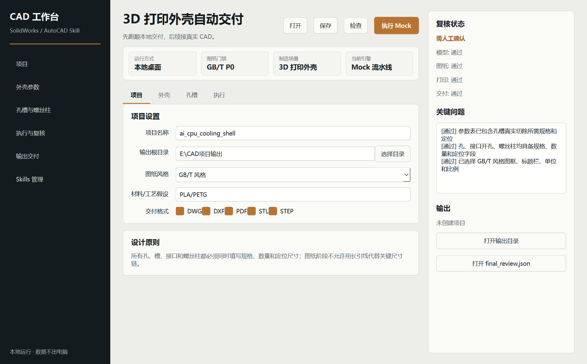

# CAD 自动化交付工作台桌面原型

这是 `solidworks-automation-skill` 的第一版本地桌面软件原型。

当前版本先跑通用户体验闭环:

```text
新建项目 -> 填写参数 -> 保存 JSON -> mock 执行 -> 生成复核报告和交付目录
```

真实 SolidWorks / AutoCAD 自动化会在后续版本接入同一条执行流水线。



界面设计规则见 `DESIGN.md`，当前视觉方向是“安静的工程控制室”: 工程纸面背景、炭黑导航、单一铜色强调、清晰 P0 复核反馈。

## 安装依赖

```powershell
python -m pip install -r apps/desktop/requirements.txt
```

## 启动

```powershell
python apps/desktop/run.py
```

也可以直接用 PowerShell 启动脚本:

```powershell
powershell -ExecutionPolicy Bypass -File apps/desktop/start_desktop.ps1
```

## 打包 exe

```powershell
powershell -ExecutionPolicy Bypass -File apps/desktop/build_exe.ps1
```

打包完成后，可执行文件位于:

```text
apps/desktop/dist/CADAutomationWorkbench/CADAutomationWorkbench.exe
```

## 当前能力

- 本地项目目录创建。
- 打开已有项目并回填参数。
- 3D 打印外壳参数表单。
- 孔、接口开孔、螺丝柱结构化表格。
- 单独执行参数完整性检查。
- 输出 `project.json`、`parameters.json`。
- mock 生成模型、图纸、复核报告、`manifest.json` 和交付说明。
- P0 规则检查结果可视化。
- 左侧导航可直接切换关键流程，或打开输出目录和 skill 仓库。

## 当前限制

- 还没有调用 SolidWorks COM。
- 还没有调用 AutoCAD COM。
- 生成的 CAD 文件是 mock 占位文件，不可用于制造。
- P0 检查当前基于参数完整性和文件结构，后续要接真实模型/图纸复核。
