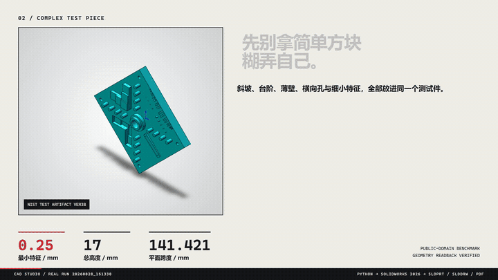

# SolidWorks Engineering Drawing

工程图生成与制造交付审视子技能。它可以被根 `solidworks-automation`、VibeCAD、孔槽/CNC
子技能或工程编排器按需连接，不要求其他建模子技能反向依赖它。

## 真机案例

<p align="center">
  
</p>

案例在 SolidWorks 2026 SP01.1 中读取 NIST 公共领域 Additive Manufacturing Test Artifact Ver3B，先核对模型包围盒，再生成 GB/T 第一角 A1 工程图。实际交付包含：

- 原生 `SLDPRT` 与 `SLDDRW`
- 三视图、等轴测图和 A-A 剖视
- 10 个必需尺寸与孔位/基准要求
- PDF、BMP 预览、`drawing_evidence.json` 和 `drawing_review_report.json`
- 当前工程图定向测试 70 项通过，实验产物的 PDF 可提取文字边界 0 重叠

该案例用于证明“代码驱动 SolidWorks → 原生工程图 → 结构化证据”的完整链路，不代表无人值守制造放行；最终图框、尺寸链、孔表和制造语义仍需工程师目视复核。

## 输入

使用 `schemas/drawing_spec.schema.json` 描述：

- 源 `.sldprt` / `.sldasm` / 钣金模型
- GB/T 或 ISO 标准、图幅和投影法
- 视图、比例、剖视和局部放大
- 必需尺寸、孔槽规格/数量/定位
- 标题栏、技术要求、BOM 和交付输出

## 输出

- `.slddrw`
- PDF
- BMP/PNG 预览
- `drawing_evidence.json`
- `drawing_review_report.json`
- Markdown 审查摘要

## 兼容入口

历史调用仍可使用根路径：

```python
from scripts.sw_drawing import plan_standard_view_layout
```

## 跨版本真机矩阵

```powershell
$env:CAD_STUDIO_VISIBLE='false'
python tests/solidworks_drawing_version_matrix.py --years 2024 2025 2026
```

矩阵按精确版本 ProgID 串行执行，输出每个版本独立工程图报告和总矩阵 JSON。未注册版本记录为 `unavailable`；只有回读年份与请求年份一致时才记为 `pass`。

新代码应优先使用本子技能脚本，并通过根技能提供的 COM/session API 执行。

## 状态

当前为 `pilot`。交付时强制将 COM 尺寸位置与 SolidWorks 导出 PDF 的实际矢量文字框一一关联；
关联完整且没有碰撞时可返回 `pass`。缺 PDF、缺 PyMuPDF、匹配不完整或发现重叠时不会放行。
